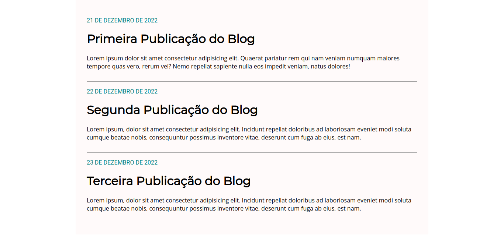

# Blog minimalista
O site fui criado durante o curso "Programador Full Stack Javascript" da onebitcode.

## O qué e o projeto
Se trata de um blog com estilo minimalista

## Principais funcionalidades
### Listagem dos post
O blog faz a listagem dos posts na pagina home

## Como Executa-lo

Basta clonar o projeto, ou baixar e abrir o arquivo index.html, eu seu navegador.

## Diário de bordo

**Dia 1 - 21/07/2021**
Apenas criei a página home e adicionei um polco de CSS para deixá-la mais apresentável
